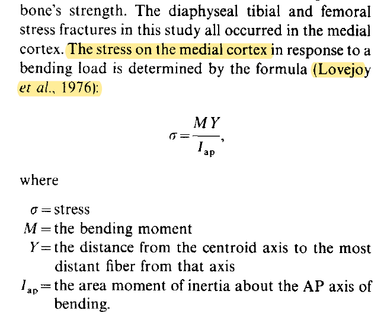

# The area moment of inertia of the tibia: a risk factor for stress fractures
[Milgrom et al 1989](../References/Milgrom1989Area.pdf)

### Notes
I guess there is a third group in the stress fracture debate: those who think it affects some populations more than others. 
Promoted by Giladi and colleagues working with the Israeli military, they were trying to figure out why their trainees got 
more stress fractures than american servicemembers. Some of their early work suggested it was external hip rotation, but now
they think it might be tibia width or area moment of inertia (intrinsic factors). 

Diving deeper into the [Milgrom 1988](../References/Milgrom1988Analysis.pdf) paper where they measured tibial cross sections in military
trainees and found that area moment of inertia about AP axis (like tibia width) was related to lower incidence of stress fracture.

Nice to see them test this hypothesis about tibia area moment of inertia on all stress fractures as well as just tibia or femoral.

### Results
- Area moment of inertia about AP axis at Level 2 (average of 8.7cm above ankle joint) was best predictor for risk of overall
stress fracture, femoral stress fractures, and tibial stress fractures. ( p = 0.004, p <0.001, p = 0.016, respectively)
- They broke recruits into equal-sized groups based on area moment of inertia:
    - Significant differences in incidence rates between end-of-spectrum groups (top/bottom third) (table 2)
- Tibia stress fracture: area moment of inertia about AP axis was a better predictor than tibial width
- Femoral stress fracture: tibial width better predictor than area moment of inertia
- height and weight had no effect.
- no significant relationship between pre-training bone mineral density and stress fracture incidence
### Discussion
Larger area moment of inertia results in smaller stresses on the medial cortex of the tibia:

    
*Their results suggest that bending forces play a key role in stress fracture incidence*

### Notable References
1. Frankel and Burstein 1971 Elasticity
1. Miller and Purkey 1980 The geometric properties of paired human tibiae
1. Minns et al 1975 The geometric properties of human tibiae
1. Lovejoy et al 1976 The biomechanical analysis of bone strength: a method and its application to platycnemia