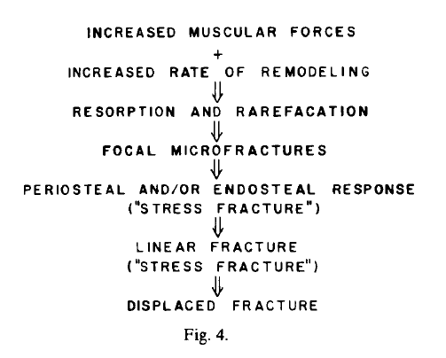
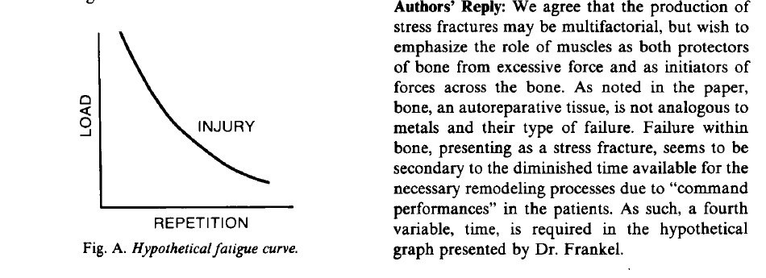

# On the nature of stress fractures
[Stanitski et al 1981](../References/Stanitski1978Nature.pdf)

Stanitski is **not** on team *Muscle Fatigue increases forces transmission to bone*, 
but supports team *Muscles produce forces and that can break bones*. They explain that non-weight bearing bones
can have stress fractures (ribs - caused by repetititve submaximal muscular contractions: coughing). They propose
that stress fractures occur as a function of stress magnitude, duration, and bone's remodeling abilities:

- Propose that stress fractures are an extension of the microfractures that occur normally in bone remodeling, occurring
when forces are continually applied and microfractures cascade to nearby structures.

- To date (1981), stress fractures have only been identified in 3 animals:
    1. Racing horces (7,12)
    1. Racing greyhounds (9)
    1. humans
    
Comment on the notion that physically unfit individuals (military recruits) get more stress fractures:
>Morris and Blickenstaff (27) commented that it was the usually high motivated recruits in the military systems who
>tended to suffer the fatigue of fractures. Indeed, most of the patients reported in this [current] paper suffered
>their fractures during mid- to late season at times when they were fully conditioned and at a maximal performance.

I think there is usually a distinction between pain and discomfort, but with running, sometimes the line is blurred.
 Unlike an older military study that says that women are bad at knowing when to stop, I think it's activity based. 
 Reminds me of some quote (maybe from Chris Solinski or Alan Webb) about how racing hurts from the very beginning 
 and how runners are told to "push through it". Maybe the people who don't get stress fractures are the ones who 
 have learned to tell the difference between discomfort and bone-breaking pain?

### Editorial Comment by Frankel VH
*who appears to disagree with the authors...*
- brings up that fractures can happen with an acute load (not really *stress* fracture though, just breaking a bone)
- says that load-repition curve should flatten out so that repetitive submaximal loads never induce injury. This is
the case in many metals, but not really in bone depending on how rapid the loads are occurring. 

*Fig A. is part of Frankel's comment, not the author's reply.*

- Proposes 4 mechanisms (*Frankel's Four Horsemen of Stress Fractures*, as I've dubbed them): 
    1. Muscle contractions overloading bone
    1. muscle fatigue causing altered stress distribution of bone
    1. changes in the ground reaction force (*first time I've seen "ground reaction force"!*)
    1. "High repitition of stress application, even though the stresses are kept at a relatively low value"
- Quick note about how stress fractures on the side of the bone primarily under tension can quickly lead to a complete
fracture, while those on the side under compression develop slower (allowing more time for repair).
#### Author's reply to Frankel VH
- yeah it's multifactorial, but bone repairs itself and isn't exactly a metal. The time available for repair appears
to be related to injury, so a load-repetition fatigue curve should also consider time (somehow).

### Notable References:
1. Hartley 1943 "Stress" or fatigue fractures of bone. British Journal of Radiology 16: 255-267