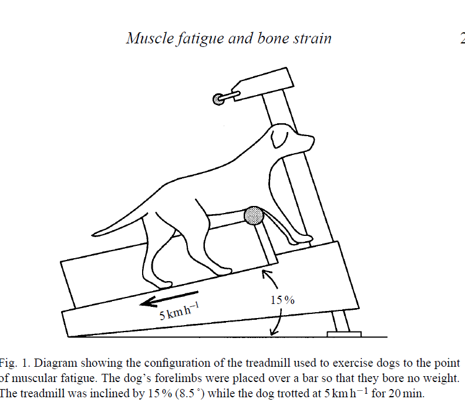

# The effects of Muscle Fatigue on Bone Strain
[Yoshikawa et al 1994](../References/Yoshikawa1994Effects.pdf)

    
*a very unique experimental setup*

### Notes
- If a bone is under tension, muscle contraction may partially counteract the tension of the bone (Radin et al 1979)
- bone is weakest under tension (yamada 1970, Evans 1973)

So maybe if the bone is under tension, the compressive force of the muscle is protective. Then if muscle activation decreases,
this results in more tensile loads on the bone. Oh my god there are a lot of things going on with bone loading.

### Purpose
subject foxhounds to a fatiguing exercise while measuring EMG and tibial bone strain. 
### Methods
 They picked the hamstrings
and quadriceps to monitor with EMG because they control the acceleration of the limb and apparently have been
shown to increase grf loading rate: Jefferson et al 1990, Radin et al 1991

Only took 2 days for some dogs to learn to walk with their hind limbs on a treadmill... impressive.
They walked 20 minutes a day at 5km/hr on a 15% inclined treadmill. Strain gauges were applied to the tibia (anterior, lateral, antero-lateral, antero-medial, and medial cortices).

defined muscle fatigue as a shift towards lower frequency content in emg signals (lindstrom et al 1977, petrofsky et al 1982, nagata et al 1990).

### Results
- No change in frequency for hamstrings, but quadriceps decreased (p =0.05) and were considered fatigued.
- The tibia was bending during exercise, but peak strain increases were not statistically significant.
- shear strain increased on the tensile side (anterio-lateral) ~30% compared to ~10% on the compressive side

### Discussion
clinical observations linking muscle fatigue and stress fractures:
1. koplan et al 1982
1. dressendorfer et al 1991

fatigue in the quads was associated with a 35% increase in strain on the lateral surface of the tibia. 

### Notable References
impact forces
1. Grimston et al 1991 - bone mass, external loads and stress fracture in female runners

Other:
1. Devas 1975 stress fractures (London: Churchill-Livingston)

old people get stress fractures: 
1. Blickenstaff and Morris, 1966, 
1. Todd et al 1972, 
1. Freeman et al 1974

Muslces reduce tensile load
1. Radin et al 1979 - practical biomechanics for the orthopedic surgeon

bone weak under tension
1. yamada 1970 - strength of biological materials
1. evans 1973 - mechanical properties of bone

bone is weak in shear
1. reilly and burstein 1974 - the mechanical properties of cortical bone
1. cowin 1989 - the mechanical properties of cortical bone tissue

Loading rate
1. jefferson et al 1990 - the role of the quadriceps in controlling impulsive forces around heelstrike

muscles and soft tissues can *potentially* dissipate forces by eccentric contraction:
1. Paul et al 1978 - musculo-skeletal shock absorption: relative contribution of bone and soft tissues at various frequencies
1. Pauwels 1980; - contributions of the functional anatomy of the locomotor apparatus. Biomechanics of the locomotor apparatus
1. Hill 1962 - Production and absorption of work by muscle
1. McMahon 1984 - muscles, reflexes, and locomotion
1. Bergmann et al 1991 - hip joint loading during going up- and downstairs

